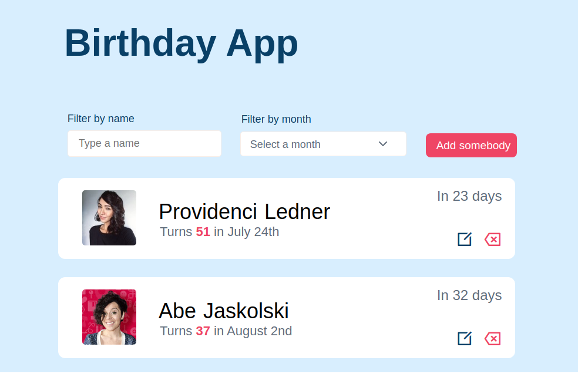
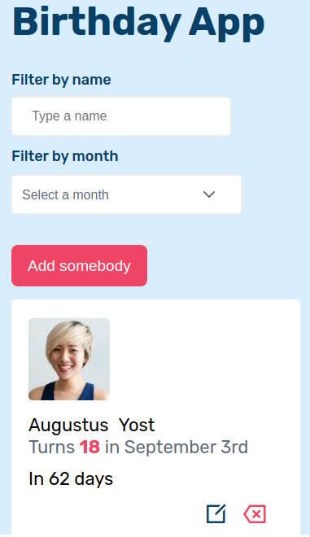

# Birthday App

## Features

This is a birthday app to display list of people, sorted by people who will have their birthday the soonest.

The users will be able to add a new element on the list in the app:

- First name
- Last name
- Birthday
- An url for their image

The users can edit a person's on the list. When you click the edit button, a modal will appear with a form inside, to edit any attribute.

The users can delete a person's birthday. There is a modal that will ask if you're sure to delete that person.

The users can filter name and select a month at the same time to search for people's birthday.

Every action is persisted into the local storage.

## Technologies

- Vanilla Javascript
- CSS
- HTML

## How to launch this app

- You need to run command npm start.

## Contact

- [Github](https://github.com/Ny-Rianala)
